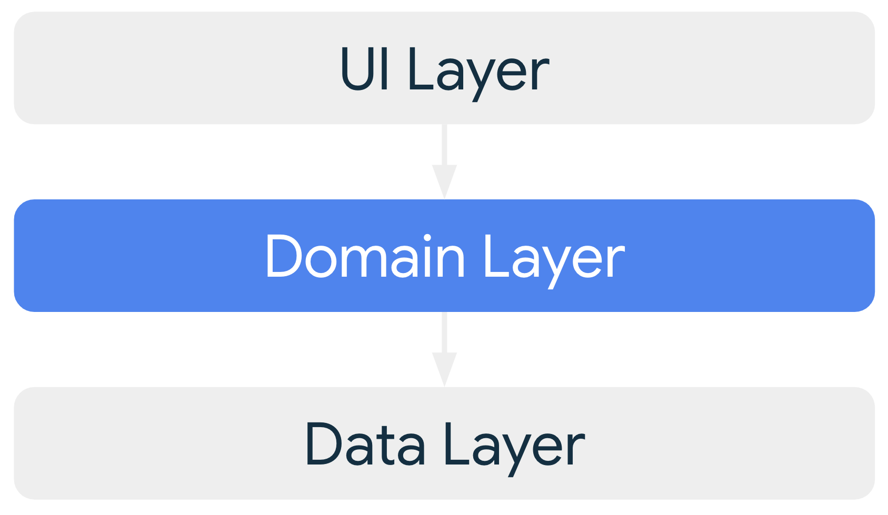
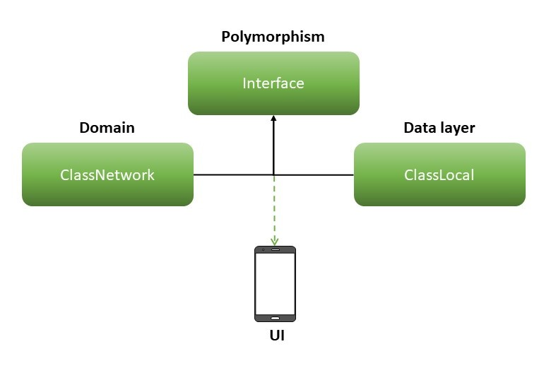

<h3 align="center">Scholar-Education Android App</h3>

## About The Project

An online education management system to help students and teachers for example: Educational videos, summaries, and motivational stories written by students. It also allows teachers to promote themselves, as the teacher publishes his own books, notes, videos, and solving course questions. The student has a material portfolio, and he has the choice to buy anything he wants from the site for a very small amount that is spent from Before the wallet he owns.

## Features

- Clean Architecture
  

  
  

- Multi Module
    
 Modularization is a practice of organizing a codebase into loosely coupled and self contained parts. Each part is a module. Each module is independent and     serves a clear purpose.

- Cache Database
    
The most common use case is to cache relevant pieces of data so that when the device cannot access the network, the user can still browse that content while they are offline.

- Project Architecture and Data Handling
  
In this project, we have adopted the principles of a clean architecture, which emphasizes modularization and separation of concerns. As a consequence of this architectural approach, direct access to the data layer is restricted, and our interactions are exclusively channeled through the domain layer.

### Data Transfer and Transformation

Transferring and transforming data between the data layer and the domain layer is a crucial aspect of our design. To achieve this, we leverage two distinct strategies:

1. **Wrapper Pattern**: This pattern involves creating intermediary components that adapt the interfaces of the data layer to align with the needs of the domain layer. It facilitates seamless communication between the layers without requiring extensive modifications to the existing code.

2. **Inheritance and Polymorphism**: Another strategy we employ is based on inheritance and polymorphism. This approach enables data to be seamlessly transferred and transformed by building upon common base classes and leveraging polymorphic behavior.
### Chosen Approach
  In this project, we have opted to implement the **Inheritance and Polymorphism** methodology to handle data transfer and transformation.
   

## Built With

* 
* 
* 
* 
* 
* 
* 
* 

## FAQ

### Why is the Data Layer Added to the App Module?

In our project, we utilize the Hilt library for dependency injection. Hilt simplifies and automates the process of injecting dependencies into our classes. However, Hilt has specific requirements for how it handles injection, particularly in relation to modules and component hierarchies.

One key requirement is that Hilt can't handle injection across different components directly. This means that if we have separate components for different layers of our app (e.g., app, presentation, data), Hilt cannot seamlessly inject dependencies from one layer into another.

To address this limitation and ensure proper injection, we've made the decision to include the data layer within the app module. By doing so, we maintain a single Hilt component hierarchy within the app module, allowing dependencies to be injected across layers effectively.

While this approach may deviate from a strict clean architecture separation, it's a pragmatic choice to ensure that Hilt can manage injection efficiently and to avoid creating unnecessary complexities in the dependency injection setup.

By having the data layer in the app module and adhering to Hilt's guidelines, we strike a balance between maintainability, modularity, and practicality in our application's architecture.

## Find this repository useful? :heart:
Support it by a star for this repository. :star:  
Also, __[follow me](https://github.com/mohamedshasho/)__ on GitHub, __[follow me](https://www.linkedin.com/in/mohammad-shasho/)__ on LinkedIn ! 🤩
